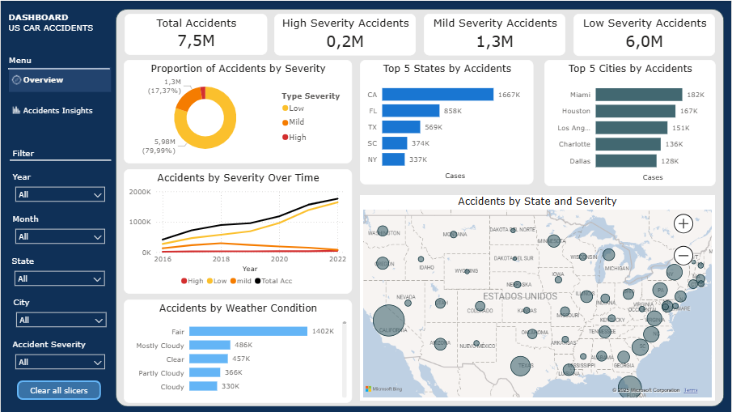

# 🚗 U.S. Traffic Accidents Analysis (2016–2022)

Power BI dashboard designed to support data-driven road safety decisions.

---

## 📌 Overview
This personal project analyzes traffic accidents across the United States between 2016 and 2022, designed from the perspective of **government agencies and transportation authorities**, focusing on trends, severity, and geographic patterns.

---

## 🎯 Objectives
- Identify states and cities with the highest number of accidents  
- Analyze accident severity and associated weather conditions  
- Evaluate temporal trends and seasonality  
- Detect high-risk zones through geospatial analysis  

---

## 🔹 Executive Insights
- Over **7.5 million traffic accidents** were recorded nationwide between 2016 and 2022.  
- Total accident volume shows a **consistent upward trend**, driven primarily by **low-severity accidents**.  
- Medium and high-severity accidents remain relatively stable over time.  
- **California, Florida, Texas, South Carolina, and New York** account for a significant proportion of total accidents.  
- Accident concentration is higher in **Eastern and Southeastern regions** of the United States.  
- Most accidents occur under **fair** and **mostly cloudy** weather conditions.

---

## 🔍 Deep-Dive Analysis: California & Los Angeles
- California has the highest number of accidents, with **Los Angeles** being the most affected city.  
- Seasonal analysis shows a **recurring increase in accidents starting in October** (2021–2022), indicating a year-end risk pattern.  
- Overall accidents peak during **early afternoon hours (13:00–15:00)**.  
- **High-severity accidents** peak late at night, around **23:00 hours**.  
- Spatial clustering identifies **critical hotspots** of high-severity accidents along **I-110 and I-10 highways**.

---

## 📊 Dashboard Preview
### General Overview

---

## 🛠️ Tools & Skills
- Power BI  
- Power Query  
- DAX (calculated measures and KPIs)  
- Data visualization & storytelling  

---

## 🚀 Future Improvements
- Normalize accident counts using **population or traffic volume**  
- Include **predictive analytics** for high-risk periods  
- Optimize **DAX measures and dashboard performance**  

---

